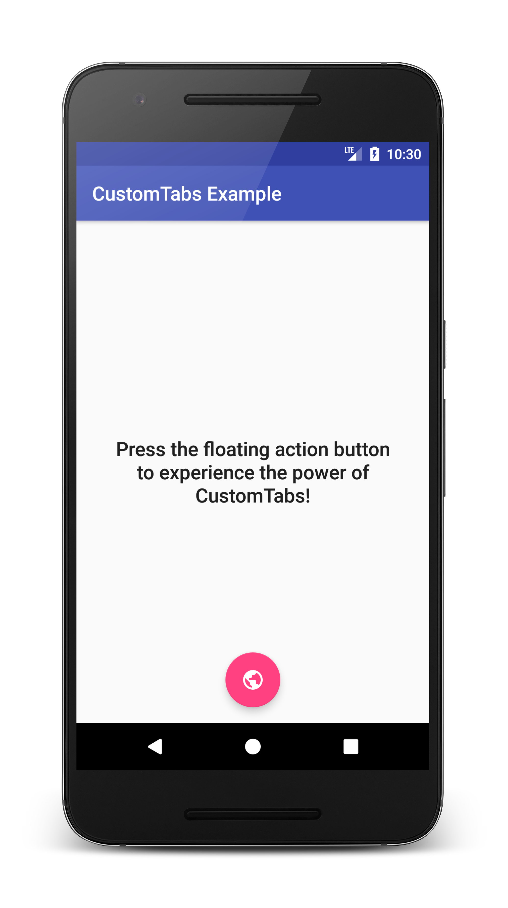
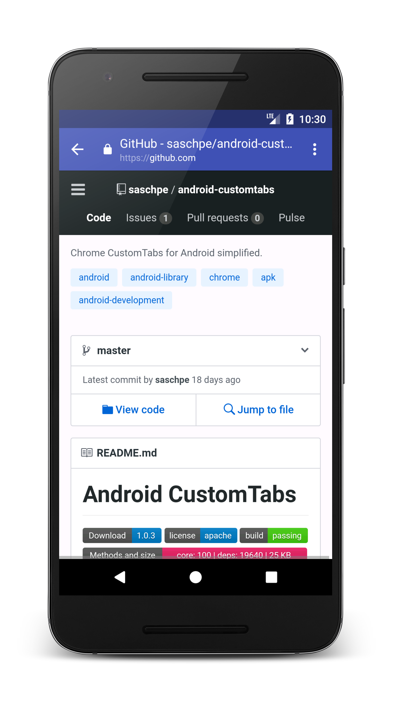
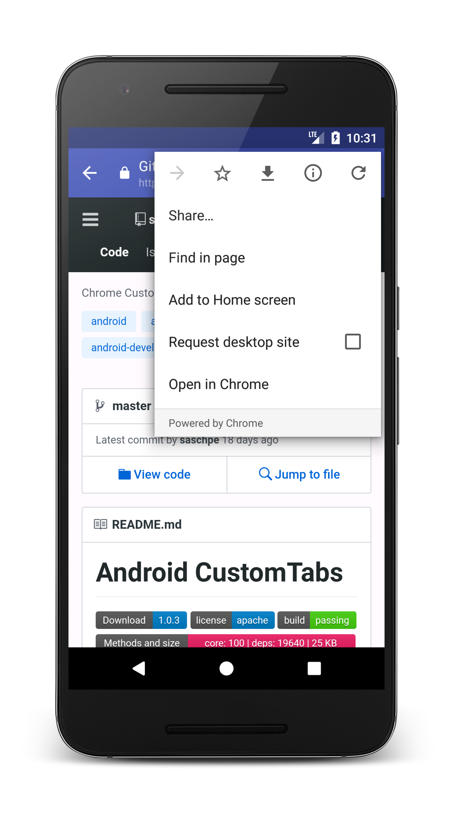

# Android CustomTabs
[](https://bintray.com/saschpe/maven/android-customtabs/_latestVersion)
[](https://android-arsenal.com/details/1/5872)
[](http://www.apache.org/licenses/LICENSE-2.0.html)
[](https://travis-ci.org/saschpe/android-customtabs)
<a href="http://www.methodscount.com/?lib=saschpe.android%3Acustomtabs%3A1.1.1"></a>

Chrome CustomTabs for Android demystified. Simplifies development and provides
higher level classes including fallback in case Chrome isn't available on device.

# Usage
How to create a new custom tab intent and start it with a keep-alive service
as well as a fallback to plain old WebView should Chrome not be available on
the device:

```java
CustomTabsIntent customTabsIntent = new CustomTabsIntent.Builder()
        .addDefaultShareMenuItem()
        .setToolbarColor(this.getResources().getColor(R.color.colorPrimary))
        .setShowTitle(true)
        .setCloseButtonIcon(backArrow)
        .build();

// This is optional but recommended
CustomTabsHelper.addKeepAliveExtra(this, customTabsIntent.intent);

// This is where the magic happens...
CustomTabsHelper.openCustomTab(this, customTabsIntent,
        Uri.parse("https://github.com/saschpe/android-customtabs"),
        new WebViewFallback());
```

Preload CustomTabs in your Application.java to warm-up early and reduce start-up
time:

```java
// Preload custom tabs service for improved performance
// This is optional but recommended
registerActivityLifecycleCallbacks(new CustomTabsActivityLifecycleCallbacks());
```

## Screenshots




# Download
```groovy
compile 'saschpe.android:customtabs:1.1.1'
```

Snapshots of the development version are available in [Sonatype's `snapshots` repository][snap].

# Usage
* [Alpha+ Player](https://play.google.com/store/apps/details?id=saschpe.alphaplus)

# License

    Copyright 2017 Sascha Peilicke

    Licensed under the Apache License, Version 2.0 (the "License");
    you may not use this file except in compliance with the License.
    You may obtain a copy of the License at

       http://www.apache.org/licenses/LICENSE-2.0

    Unless required by applicable law or agreed to in writing, software
    distributed under the License is distributed on an "AS IS" BASIS,
    WITHOUT WARRANTIES OR CONDITIONS OF ANY KIND, either express or implied.
    See the License for the specific language governing permissions and
    limitations under the License.


 [snap]: https://oss.sonatype.org/content/repositories/snapshots/
